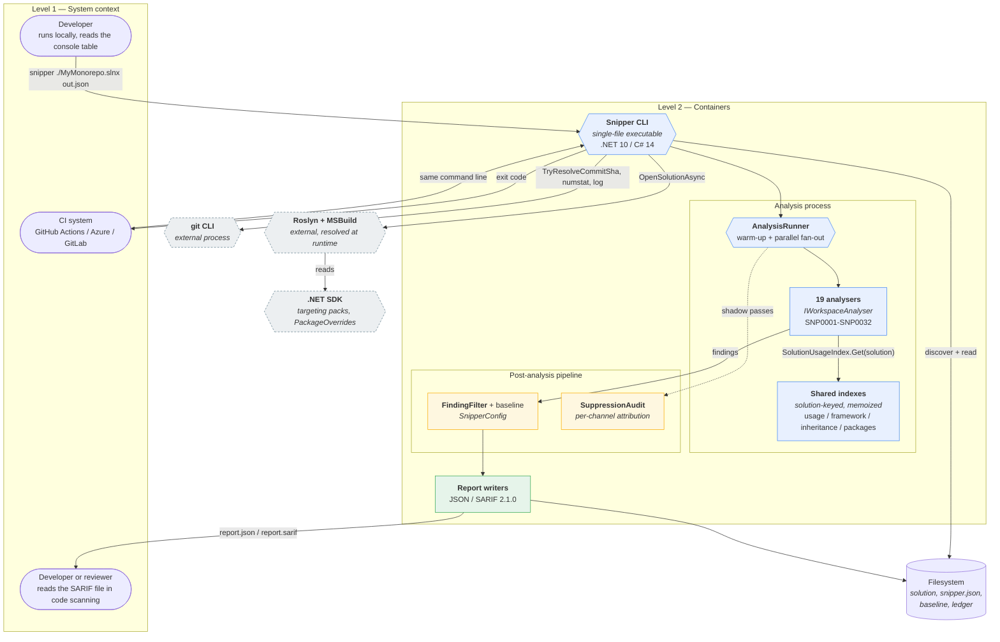

# Code architecture

A map of the codebase for people who want to contribute to it. It explains how Snipper gets code into
memory, how analysers run, and how findings become a report — and, importantly, which invariants you
must not break when adding to it.

Written against the 1.7.4 tree, ~14,990 lines of C# across 80 files in `src/Snipper` (19 registered
analysers, 28 rule IDs, 590 tests), zero third-party runtime dependencies beyond Roslyn, MSBuild, and
Spectre.Console.

For *using* the tool see the [usage guide](usage.md). For *why* the design is the way it is see
[`1_7_0_plan.md`](history/1_7_0_plan.md), [`1_7_3_plan.md`](history/1_7_3_plan.md) and
[`1_7_4_plan.md`](history/1_7_4_plan.md).

---

## Contents

1. [The 60-second version](#the-60-second-version)
2. [C4: system context and containers](#c4-system-context-and-containers)
3. [Sequence: one run, end to end](#sequence-one-run-end-to-end)
4. [Class diagram](#class-diagram)
5. [How code gets into memory](#how-code-gets-into-memory)
6. [The analyser contract](#the-analyser-contract)
7. [Anatomy of a semantic analyser](#anatomy-of-a-semantic-analyser)
8. [The shared index pattern](#the-shared-index-pattern)
9. [Anatomy of the syntax-only analyser](#anatomy-of-the-syntax-only-analyser)
10. [The filtering pipeline](#the-filtering-pipeline)
11. [The lifted shadow pass](#the-lifted-shadow-pass-and-why-it-only-runs-half-the-analysers)
12. [Performance: what was measured](#performance-what-was-measured-and-what-was-not)
13. [Git integration](#git-integration)
14. [Output](#output)
15. [Invariants you must not break](#invariants-you-must-not-break)
16. [Adding a rule: checklist](#adding-a-rule-checklist)
17. [Testing conventions](#testing-conventions)
18. [Where things live](#where-things-live)

---

## The 60-second version

```
args ──► CommandLineParser ──► CliRunner ──► MSBuildWorkspace ──► Solution
                          │
                          ├──► up to 19 IWorkspaceAnalyser instances, fanned out in parallel
                          │      each returns its own findings list
                          │
                          ├──► (optional) shadow passes with suppressions lifted
                          │
                          └──► baseline fingerprint ──► FindingFilter ──► certainty tier
                                                        │
                                        Console table + JSON/SARIF + ledger
```

Five things to internalise before reading further:

1. **`CliRunner` is the orchestrator, and only the orchestrator.** It owns workspace opening, pass
   sequencing, the baseline, and the filter order — the things that genuinely need everything at
   once. Argument parsing, report serialisation, console rendering and analyser construction live
   in `CommandLineParser`, `ReportWriter`, `ConsoleRenderer` and `AnalyserFactory`, all of which are
   pure with respect to the orchestration. It is the only file you need to read to understand the
   run order, and at 570 lines it is half the size it was.
2. **Analysers are independent and stateless.** Each takes the same immutable `Solution` and returns
   its own list. All sharing happens through memoized solution-keyed indexes, never through mutable
   fields.
3. **Compilation warm-up is deliberate and sequential.** Every analyser opens with
   `GetCompilationAsync`; without the pre-warm, 19 analysers discover the same cold compilations at
   once and serialise on Roslyn's compilation tracker. Measured: 33 s naive versus 4.6 s warmed.
4. **Two suppression classes, and the difference is load-bearing.** Namespace exclusions and
   whole-analyser disables remove findings *before they exist*; rule-off, path globs and severity
   overrides filter them *after*. This is why the baseline needs a second, lifted pass.
5. **Determinism is a contract.** Findings come back in analyser declaration order, not completion
   order, and reports are byte-identical run to run.

---

## C4: system context and containers

Level 1 (context) and Level 2 (containers). Mermaid's `C4Context`/`C4Container` syntax is not
supported by every renderer; this uses `flowchart` with C4-style boundaries so it renders anywhere
Mermaid does.



### The external dependencies, and why each one is shaped the way it is

| Dependency | How it is reached | Why it matters to you |
| --- | --- | --- |
| **Roslyn** (`Microsoft.CodeAnalysis`) | Compile-time reference | `Solution`, `Compilation`, `SemanticModel`, `SyntaxNode`. The whole analyser model is built on these. |
| **MSBuild** (`Microsoft.Build.Locator`) | **Runtime assembly resolution only** — never a compile-time reference | `MSBuildLocator.RegisterDefaults()` must run before any MSBuild/Roslyn workspace type is touched. See [How code gets into memory](#how-code-gets-into-memory). |
| **Spectre.Console** | Compile-time reference | `Status` (spinner), `Table`, `AnsiConsole`. `StatusContext` is **process-wide exclusive and not thread-safe** — every write from an analyser must funnel through one lock. |
| **git** | Child process | Everything git-related shells out. Read-only; degrades to silence outside a checkout. |

---

## Sequence: one run, end to end

The container-level interaction for `snipper ./MyMonorepo.slnx report.json --clone-drift
--entropy-budget 1.5 --baseline .snipper/baseline.json`.

```mermaid
sequenceDiagram
    autonumber
    actor User
    participant P as Program
    participant C as CliRunner
    participant MS as MSBuildWorkspace<br/>Roslyn
    participant AR as AnalysisRunner
    participant AN as IWorkspaceAnalyser
    participant BL as BaselineService
    participant FF as FindingFilter
    participant GM as GitMetadata

    User->>P: snipper ./MyMonorepo.slnx report.json<br/>--clone-drift --baseline .b.json --entropy-budget 1.5
    P->>P: --version? then MSBuildLocator.RegisterDefaults()
    P->>C: RunAsync(args)
    C->>C: CommandLineParser.TryParse(args)<br/>invalid ⇒ exit 1
    C->>C: SnipperConfigLoader.Load — tolerant,<br/>never throws
    C->>C: AnalysisExclusions.Create(CLI ∪ config)
    C->>C: AnalyserFactory.Build — drop analysers<br/>whose every rule is off

    rect rgb(232, 240, 254)
        note over C,MS: Load the code
        C->>MS: OpenSolutionAsync(target)
        MS-->>C: Solution
        MS-->>C: workspace warnings (non-fatal, deduped)
    end

    rect rgb(232, 240, 254)
        note over AR,AN: Analysis
        C->>AR: RunAsync(analysers, solution)
        AR->>AR: WarmCompilationsAsync — SEQUENTIAL,<br/>one Compilation build per project
        par fan-out, bounded by SNIPPER_FANOUT_DOP
            AN->>AN: ShouldSkipDocument → syntactic pre-filter
            AN->>AN: SolutionUsageIndex.Get(solution)<br/>shared, built once (Lazy)
            AN->>AN: prove or refute each candidate
            AN-->>AR: findings into indexed slot
        and
            AN->>AN: TokenShingleIndex.Build (syntax-only)
            AN->>AN: clone sets → CloneDriftDetector
            AN-->>AR: findings
        end
        AR-->>C: merged in declaration order
    end

    opt baseline or audit requested
        C->>AR: RunAsync(aware analysers, exclusions lifted)
        AR-->>C: suppression-independent set
    end

    rect rgb(252, 232, 230)
        note over C,FF: Filtering — order is load-bearing
        C->>BL: Load(baselinePath)
        BL-->>C: fingerprints + commitSha
        C->>C: new = visible findings not in baseline
        C->>BL: Write(fingerprints of the<br/>suppression-independent set, headSha)
        C->>FF: Apply(findings, config)<br/>rule off → path glob → severity override
        FF-->>C: filtered
        C->>C: certainty tier floor
    end

    opt entropy requested
        C->>GM: TryResolveCommitSha + TryGetNumstat
        GM->>GM: git rev-parse, git diff --numstat
        GM-->>C: head sha, dirty flag, changed lines
        C->>C: EntropyRateCalculator.Compute → status + rate
        C->>C: ledger.Append — only if Scored
    end

    rect rgb(230, 244, 234)
        note over C,GM: Output
        C->>C: ConsoleRenderer.RenderReport
        C->>C: ReportWriter.Write → BuildJson | BuildSarifJson
        C-->>User: report file + exit 0|1|2|3
    end```

### The three ordering rules worth memorising

1. **Warm-up before fan-out.** Sequential, and it swallows per-project failures. A project that
   will not compile is an analyser concern, not a precondition for the other sixteen.
2. **Baseline classification reads the visible set; baseline writing reads the suppression-independent
   set.** So a finding you cannot see is still recorded, and removing a suppression does not resurface
   it as "new". Under no churn-prone suppression the two sets are the same list and the lifted pass
   never runs.
3. **`FindingFilter` runs after fingerprinting.** Rule-off, path globs and severity overrides can
   therefore never churn the baseline file.

---

## Class diagram

The types a contributor touches, and the relationships that matter. Evaluators, scanners and
evidence indexes are omitted except where they are load-bearing.

```mermaid
classDiagram
    direction TB

    class Program {
        +Main(args) int
    }

    class CliRunner {
        +RunAsync(args) Task~int~
        +GetToolVersion() string
        -FindingsFromExclusionAgnosticAnalysers(analysers, findings) IReadOnlyList
        -AppendEntropyLedgerEntry(path, result)
        -IsExcludedFromDenominator(path, base, config) bool
    }

    class CommandLineParser {
        +Usage string
        +TryParse(args, out options, out error) bool
        -IsValidNamespace(value) bool
    }

    class CommandLineOptions {
        +required TargetPath
        +OutputPath
        +BaselinePath
        +MinimumCertainty
        +Format
        +IncludeConfigAnalysis
        +IncludeDuplicateDetection
        +IncludeCloneDrift
        +AuditSuppressions
        +EntropyRateRequested
        +EntropyBudget
        +EntropyLedgerPath
        +EntropyMinimumLines
        +ExcludedNamespaces
        +MalformedNamespaces
    }

    class AnalyserFactory {
        +Build(options, exclusions, targetPath) List
        +PartitionByExclusionSensitivity(analysers) ExclusionPartition
        -FindRepositoryRoot(targetPath) string
        -IsExclusionAgnostic(analyser) bool
    }

    class ExclusionPartition {
        +Aware
        +Agnostic
    }

    class ReportWriter {
        +Write(findings, path, format, dir, audit, entropy) int
        +BuildJson(findings, sha, audit, entropy) string
        +BuildSarifJson(findings) string
    }

    class ConsoleRenderer {
        +RenderReport(findings)
        +RenderSuppressionAudit(audit)
        +RenderEntropyRate(report)
    }

    class ToolVersion {
        +Current string
    }

    class IWorkspaceAnalyser {
        <<interface>>
        +IReadOnlyCollection~string~ RuleIds
        +AnalyzeAsync(solution, ct, progress) Task
    }

    class AnalysisRunner {
        +RunAsync(analysers, solution, ctx, ct) Task
        -WarmCompilationsAsync(solution, ct) Task
    }

    class AnalysisParallelism {
        +CreateFanOutOptions(ct) ParallelOptions
    }

    class SolutionUsageIndex {
        -Get(solution) SolutionUsageIndex
        -GetDocumentsUsingName(project, name) ImmutableHashSet~Document~
        +HasNameInProjectScope(projectId, name) bool
    }

    class FrameworkEvidenceIndex {
        -Get(solution) FrameworkEvidenceIndex
    }

    class InheritanceGraph {
        -Get(solution) InheritanceGraph
    }

    class ProjectPackageUsageCache {
        +GetUsage(project) PackageAssemblyUsage
    }

    class TokenShingleIndex {
        +Build(documents, options) Dictionary
    }

    class ExclusionEngine {
        +ShouldSkipDocument(path, root, roots) bool
        +IsNamespaceExcluded(symbol, exclusions) bool
        +IsNamespaceExcluded(node, model, exclusions, ct) bool
        +ResolveFileScopeNamespace(node) string~          // type → namespace → <global>
        +IsGeneratedDocument(path) bool
        +GetAnalysisRootDirectories(solution) IReadOnlyList~string~
    }

    class AnalysisExclusions {
        +None AnalysisExclusions
        +Namespaces FrozenSet~string~
        +Create(namespaces) AnalysisExclusions
    }

    class SnipperConfig {
        +Empty SnipperConfig
        +DisabledRules FrozenSet~string~
        +SeverityOverrides FrozenDictionary
        +ExcludedNamespaces FrozenSet~string~
        +ExcludedPathGlobs FrozenSet~string~
    }

    class SnipperConfigLoader {
        +Load(target, out configPath, warnings) SnipperConfig
        -Discover(target) string
    }

    class FindingFilter {
        +Apply(findings, config) IReadOnlyList
        +Classify(finding, config) FindingFilterClassification
        +IsAnalyserEnabled(ruleIds, config) bool
        +IsEmpty(config) bool
    }

    class FindingFilterClassification {
        +FindingFilterOutcome Outcome
        +string MatchedGlob
        +CertaintyTier EffectiveTier
    }

    class BaselineService {
        +Load(path) BaselineFile
        +Write(path, fingerprints, commitSha) void
        +ComputeFingerprint(finding, baseDirectory) string
        +RequiresSuppressionIndependentFingerprints(...) bool
    }

    class SuppressionAuditBuilder {
        +Build(analysed, config, tier, disabledShadow, nsShadow, ran, globProbe, nsProbe) SuppressionAudit
    }

    class NamespaceInventory {
        +CollectDeclaredNamespaces(solution) FrozenSet~string~
        +CollectFiles(solution) GlobFileInventory
        +ExistenceProbe(namespaces) IReadOnlyDictionary
    }

    class EntropyRateCalculator {
        +Compute(inputs) EntropyRateResult
        +CountResolved(known, current) int
        +ToReport(result, budget, monthly) EntropyRateReport
    }

    class DuplicateFragmentAnalyser {
        +RuleIds IReadOnlyCollection~string~
        -AnalyzeAsync(solution, ct, progress) Task
        -CollectFiles(solution, ct) Task
        -FindFragments(windows) fragments, matches
        -KeepMaximalMatches(matches) fragments, matches
        -BuildFindings(fragments, matches, files) findings, cloneSets
        -IsExcluded(unit, fragment, exclusions) bool
    }

    class CloneDriftDetector {
        +Detect(cloneSets, repoRoot) IReadOnlyList
        -Classify(members, commit, hunks) CloneDriftClassification
    }

    class GitHistory {
        +TryGetMostRecentCommits(repoRoot, paths, limit) Map
        +TryGetPatches(repoRoot, commits) List
    }

    class GitProcess {
        +Run(exe, args, cwd, stdin) Result
        +RunTrimmed(exe, argString, cwd) string
    }

    class GitMetadata {
        +TryResolveCommitSha(dir, out dirty) string
        +TryResolveRepositoryRoot(dir) string
        +TryGetNumstat(dir, from, to) List
    }

    class SnipperFinding {
        +string RuleId
        +string Title
        +string Message
        +CertaintyTier Certainty
        +FindingCategory Category
        +string FilePath
        +int LineNumber
        +int CharacterOffset
        +ISymbol Symbol
    }

    class CertaintyTier {
        <<enumeration>>
        Guaranteed = 1
        High = 2
        Moderate = 3
        Advisory = 4
    }

    class FindingCategory {
        <<enumeration>>
        UnreachableCode = 1
        UnusedPrivateMember = 2
        ...
        DuplicateFragment = 25
        CloneDrift = 26
    }

    class JsonReportSerializerContext {
        <<JsonSerializerContext>>
    }

    class SarifLog {
        <<SARIF 2.1.0 DTO>>
    }

    Program --> CliRunner : RunAsync
    CliRunner --> CommandLineParser : TryParse
    CommandLineParser --> CommandLineOptions : produces
    CommandLineParser --> ReportFormat
    CliRunner ..> SnipperConfigLoader : Load
    CliRunner ..> AnalysisRunner : RunAsync
    CliRunner ..> AnalyserFactory : Build, Partition
    CliRunner ..> BaselineService : Load, Write
    CliRunner ..> EntropyRateCalculator : Compute, Append
    CliRunner ..> FindingFilter : Apply
    CliRunner ..> SuppressionAuditBuilder : Build
    CliRunner ..> NamespaceInventory : CollectFiles
    CliRunner ..> GitMetadata : sha, numstat
    CliRunner ..> AnalysisExclusions : Create
    CliRunner ..> ReportWriter : Write
    CliRunner ..> ConsoleRenderer : Render*
    CliRunner ..> ToolVersion : Current
    AnalyserFactory --> ExclusionPartition : returns
    AnalyserFactory ..> DuplicateFragmentAnalyser : constructs
    AnalyserFactory ..> CloneDriftDetector : constructs
    ReportWriter ..> JsonReportSerializerContext
    ReportWriter ..> SarifLog
    ReportWriter ..> ToolVersion : Current
    SnipperReport ..> SuppressionAudit
    EntropyRateReport ..> EntropyRateCalculator : formatted by

    AnalysisRunner --> IWorkspaceAnalyser : fans out
    AnalysisRunner --> AnalysisParallelism : bounded by

    IWorkspaceAnalyser <|.. DuplicateFragmentAnalyser
    IWorkspaceAnalyser <|.. UnreachableCodeAnalyser
    IWorkspaceAnalyser <|.. UnusedPrivateMemberAnalyser
    IWorkspaceAnalyser <|.. RedundancyAnalyser

    IWorkspaceAnalyser ..> SolutionUsageIndex : Get(solution)
    IWorkspaceAnalyser ..> FrameworkEvidenceIndex : Get(solution)
    IWorkspaceAnalyser ..> InheritanceGraph : Get(solution)
    IWorkspaceAnalyser ..> ProjectPackageUsageCache
    IWorkspaceAnalyser ..> ExclusionEngine
    IWorkspaceAnalyser ..> AnalysisExclusions
    IWorkspaceAnalyser ..> SnipperFinding : produces

    DuplicateFragmentAnalyser --> TokenShingleIndex : syntax-only
    DuplicateFragmentAnalyser --> CloneDriftDetector : optional
    DuplicateFragmentAnalyser ..> ExclusionEngine
    DuplicateFragmentAnalyser ..> AnalysisExclusions

    CloneDriftDetector --> GitHistory
    GitHistory --> GitProcess
    GitMetadata --> GitProcess

    SnipperFinding --> CertaintyTier
    SnipperFinding --> FindingCategory

    FindingFilter --> SnipperConfig
    FindingFilter ..> FindingFilterClassification : Classify returns
    SnipperConfigLoader --> SnipperConfig
    SuppressionAuditBuilder --> SnipperConfig
    SuppressionAuditBuilder ..> FindingFilter : shares Classify
    SuppressionAuditBuilder ..> NamespaceInventory : probes
    BaselineService ..> SnipperFinding : fingerprints
    EntropyRateCalculator ..> BaselineService : reads fingerprints```

Note the `SuppressionAuditBuilder ..> FindingFilter : shares Classify` edge. The audit and the report
filter call **the same** `Classify` method, deliberately, so the audit's per-channel totals cannot
drift from actual report behaviour.

---

## How code gets into memory

This is the part that surprises people, so it goes first.

### MSBuildLocator must run first

```csharp
var instance = MSBuildLocator.RegisterDefaults();
```

`Program.Main` calls this before touching any MSBuild or Roslyn workspace type. MSBuild assemblies are
**never compile-time referenced** — they are resolved at runtime from the installed .NET SDK, because
a compile-time reference would pin one MSBuild version and break on every SDK upgrade.

Two consequences:

- If you add a file that references a Roslyn workspace type and touches it in a static initialiser or
  a field initialiser, it may run before `RegisterDefaults()` and fail with a confusing assembly-load
  error. Keep MSBuild-touching code behind the call.
- `--version` deliberately short-circuits **before** the locator, so `snipper --version` produces
  machine-clean output with no SDK binding noise.

### Opening the target

```csharp
solution = targetPath.EndsWith(".csproj", StringComparison.OrdinalIgnoreCase)
    ? (await workspace.OpenProjectAsync(targetPath)).Solution
    : await workspace.OpenSolutionAsync(targetPath);
```

MSBuildWorkspace 5.x handles `.sln` and `.slnx` natively through the `SolutionPersistence`
serializer.

### Load failures are non-fatal by design

```csharp
workspace.RegisterWorkspaceFailedHandler(e => { /* dedupe, print, continue */ });
```

A project that fails to restore or compile does not abort the run. Each distinct message prints once
and duplicates are counted, because a monorepo with one broken project should still be analysed. Only
`OpenSolutionAsync`/`OpenProjectAsync` failure itself is fatal (exit 1).

That fatal path catches **`Exception`** rather than a closed type list, and the asymmetry with
`ProjectFileReader` is deliberate: `ProjectFileReader` catches `XmlException` explicitly because it
loads a single known file, while the open call is a boundary into MSBuild + SolutionPersistence and any
failure from it means the target could not be opened. `OperationCanceledException` is rethrown first, so
Ctrl+C is not misreported as a bad solution file. Both the path and the message are `Markup.Escape`d,
because an `XmlException` message routinely ends `[at line 3, position 12]` and unescaped brackets are
parsed as Spectre markup.

The previous filter — IO exceptions plus `InvalidProjectFileException`/`InvalidSolutionFileException` —
was a closed list that leaked. `XmlException` derives from `SystemException`, not `IOException`, so a
hand-written malformed `.slnx` escaped as an unhandled exception and the process died with exit
-532462766 instead of 1. A `.slnx` that is well-formed XML with an invalid schema failed the same way via
`SolutionException`.

`InvalidProjectFileException` and `InvalidSolutionFileException` are no longer matched by name, because
the broad catch subsumes them; the reason they were matched by name — living in runtime-resolved MSBuild
assemblies rather than being compile-time references — is why the list could not simply be widened with
confidence at each new exception type.

### Generated and external code

`ExclusionEngine.ShouldSkipDocument` is the single gate every analyser calls. It rejects:

- Files outside the analysis root directories (so linked files from elsewhere are not analysed twice).
- Generated documents, by path convention and by `AutoGenerated` header.
- Anything the namespace exclusions cover.

---

## The analyser contract

```csharp
public interface IWorkspaceAnalyser
{
    IReadOnlyCollection<string> RuleIds { get; }

    Task<IReadOnlyList<SnipperFinding>> AnalyzeAsync(
        Solution solution,
        CancellationToken cancellationToken,
        Action<string>? progress = null);
}
```

That is the entire surface. Three properties make it safe to fan out:

1. **`RuleIds` is the single source of truth for skipping.** `FindingFilter.IsAnalyserEnabled` uses it
   to decide whether an analyser is worth running at all. If you add a rule, add its id here or it
   cannot be disabled.
2. **`Solution` is immutable.** Roslyn solutions are persistent data structures; handing the same
   instance to 17 concurrent analysers is safe by construction.
3. **`progress` is called under a lock by the runner.** `StatusContext` is not thread-safe, so the
   runner serialises writes; your callback must not assume it is on a particular thread.

A note on multi-rule analysers: `RedundancyAnalyser` emits five rules (SNP0022, 0025, 0026, 0028,
0029) from one traversal, because the traversal is the expensive part. **If you disable four of the
five, the analyser still runs and the cost is unchanged.** `DuplicateFragmentAnalyser` is the one
analyser whose `RuleIds` is conditional on its constructor arguments.

---

## Anatomy of a semantic analyser

`UnusedPrivateMemberAnalyser` is 193 lines and is the cleanest example. Every semantic analyser
follows this shape:

```csharp
public sealed class UnusedPrivateMemberAnalyser(AnalysisExclusions? exclusions = null)
    : IWorkspaceAnalyser
{
    public IReadOnlyCollection<string> RuleIds { get; } = ["SNP0001"];

    public async Task<IReadOnlyList<SnipperFinding>> AnalyzeAsync(
        Solution solution, CancellationToken cancellationToken, Action<string>? progress = null)
    {
        var analysisRoots = ExclusionEngine.GetAnalysisRootDirectories(solution);
        var usageIndex = SolutionUsageIndex.Get(solution);   // shared, built once

        foreach (var project in solution.Projects)
        {
            foreach (var document in project.Documents)
            {
                var root = await document.GetSyntaxRootAsync(cancellationToken);
                var semanticModel = await document.GetSemanticModelAsync(cancellationToken);

                if (semanticModel is null || root is null
                    || ExclusionEngine.ShouldSkipDocument(document.FilePath, root, analysisRoots))
                {
                    continue;
                }

                foreach (var node in root.DescendantNodes())
                {
                    // 1. cheap syntactic pre-filter — most nodes never become candidates
                    // 2. declared symbol
                    // 3. namespace exclusion
                    // 4. usage proof, via the index
                    // 5. emit
                }
            }
        }
    }
}
```

The ordering is the performance design, and you should preserve it when you add a rule:

| Step | Cost | Purpose |
| --- | --- | --- |
| `ShouldSkipDocument` | trivial | One gate for generated/external/excluded code. |
| Syntactic pre-filter | cheap | Reject most nodes without a symbol. Avoids a `GetDeclaredSymbol` per node. |
| `GetDeclaredSymbol` | moderate | Only for surviving candidates. |
| `IsNamespaceExcluded` | cheap | Before any expensive evidence work. |
| Usage proof | expensive | `SolutionUsageIndex` name lookup is O(1); a `FindReferencesAsync` is the fallback and is **restricted to the documents the index says can contain the name**. |

The index's invariant is the trick worth understanding: *any semantic reference to a named symbol
must spell its name in source*. So "this name appears in no in-scope document" **proves** zero
references without a reference search. When the name does appear, the search is narrowed to exactly
those documents.

---

## The shared index pattern

Four indexes are shared across analysers: `SolutionUsageIndex`, `FrameworkEvidenceIndex`,
`InheritanceGraph`, `ProjectPackageUsageCache`.

They are memoized on the `Solution` instance with a `ConditionalWeakTable<Solution, Lazy<T>>`:

```csharp
private static readonly ConditionalWeakTable<Solution, Lazy<SolutionUsageIndex>> Cache = new();

internal static SolutionUsageIndex Get(Solution solution)
    => Cache.GetOrCreateValue(solution, static s => new Lazy<SolutionUsageIndex>(
        () => Build(s), LazyThreadSafetyMode.ExecutionAndPublication)).Value;
```

Four things this buys, all of which matter:

- **Built once, no matter how many analysers ask.** First touch blocks on one build; concurrent
  readers never duplicate the work.
- **`LazyThreadSafetyMode.ExecutionAndPublication`** means exactly one build even under the fan-out.
- **`ConditionalWeakTable`** keys on object identity, so a discarded `Solution` is collectable. A
  static `Dictionary<Solution, T>` would leak every workspace the process ever opened.
- **The indexes themselves are immutable and frozen** (`FrozenDictionary`, `FrozenSet`,
  `ImmutableHashSet`) once built, so concurrent reads need no locking.

If you add a shared index, follow the same pattern. If you add a mutable field to an analyser, you
break the fan-out - `SNIPPER_MAX_DOP=1` is the escape hatch, and it is also your signal that you have
done something wrong.

### Per-symbol and per-node memos

Some work is a pure function of something immutable, but keyed too coarsely to sit in a
`solution`-level index. Those use the same weakly-keyed memo at a finer grain:

| Memo | Key | Pure function of |
| --- | --- | --- |
| `ExclusionEngine.FrameworkEntryPointTypes` | `INamedTypeSymbol` | The type. Walks every method's attributes, so it is O(members) per *call*, and it is called once per candidate symbol from six analysers. |
| `DocumentIdentifierIndex.ByRoot` | `SyntaxNode` (the document root) | The tree. Two analysers built the same index from the same root. |
| `ProjectFileReader.Cache` | Project path + last-write | The csproj. Five call sites each parsed the same file; invalidated by timestamp because a stat is far cheaper than an XML parse. |

The rule: **key on the narrowest immutable thing that determines the answer.** Roslyn symbols and
syntax nodes are immutable, so a `ConditionalWeakTable` on them is sound, and it keeps the entry
collectable with the compilation that produced it. A lost race just recomputes the same value - that
is safe precisely because the value is a pure function.

---

## Performance: what was measured, and what was not

Every number below comes from an **interleaved A/B** (alternating runs of two binaries so machine
drift cancels). Single-sample deltas on this box are unreliable: one target measured 3.8% *slower*
from a real improvement when compared non-interleaved. Treat sub-5% wall-clock deltas as noise.

### Where the time actually goes

The analyser fan-out is well-tuned and is *not* the bottleneck on real solutions. Phases measured
across six targets:

| Target | total wall | analysis fan-out | MSBuild load + output | load share |
| --- | --- | --- | --- | --- |
| Peckr.sln (8 proj) | 5.41 s | 1.70 s | 3.71 s | **69%** |
| AzureBusDepot.sln (4 proj) | 4.04 s | 1.40 s | 2.64 s | **65%** |
| Cscli.sln (3 proj) | 9.25 s | 4.80 s | 4.45 s | **48%** |
| Snipper.csproj (1 proj) | 7.29 s | 4.50 s | 2.79 s | 38% |

`MSBuildWorkspace.OpenSolutionAsync` is single-threaded per project and everything downstream needs
its `Solution`, so its cost cannot overlap with analysis. Measured CPU/wall is 1.7-3.0x on a 16-core
box - roughly 80% of the machine idle. **The biggest remaining lever is the load phase, not the
analysers.**

### Runtime configuration

`TieredPGO` is off in `Snipper.csproj`. Snipper is short-lived and spends its life repeating the
same Roslyn/MSBuild call patterns, so instrumented tier-1 recompilation costs more than the
optimised code saves:

| Target | wall | CPU |
| --- | --- | --- |
| Snipper.csproj | -5.5% | **-17.3%** |
| Cscli.sln | -6.8% | **-16.1%** |
| Peckr.sln | -2.9% | **-11.6%** |
| AzureBusDepot.sln | -5.4% | **-14.3%** |
| CardanoSharp.sln | -11.1% | **-18.6%** |
| Mintsafe.sln | -7.0% | **-15.0%** |

CPU falls further and more consistently than wall clock, which is the signature of less work rather
than rescheduling. Override with `DOTNET_TieredPGO=1` if a future workload regresses.

Two knobs were measured and **rejected**, which is worth recording so nobody re-litigates them:

- **Server GC** - neutral to *worse* (Cscli 7.91 -> 8.79 s). Startup cost dominates a single-shot
  process.
- **`TieredCompilation=0`** - **+27% worse**. Disabling tiered JIT entirely is far too expensive for
  a 7-second run.

### Cumulative effect

All of the above plus the allocation and memos below, Phase 0 -> current, interleaved:

| Target | wall | CPU |
| --- | --- | --- |
| Snipper.csproj | -10.5% | **-20.3%** |
| Cscli.sln | -13.3% | **-20.4%** |
| Peckr.sln | -12.8% | **-23.4%** |
| AzureBusDepot.sln | -2.2% | -7.8% |
| CardanoSharp.sln | -18.1% | **-25.3%** |
| Mintsafe.sln | -10.2% | -16.4% |

Verified output-neutral: the `findings` array is byte-identical on all six targets.

### The waste that was removed

| Change | What it was wasting |
| --- | --- |
| `FrameworkEvidenceIndex` receiver text | `memberAccess.Expression.ToString()` ran for **every** invocation, but `receiverText` is only read for 7 method names out of ~4,500 invocations. ~99.9% of those strings were built and discarded. Now gated on the identifier first. |
| `FrameworkEvidenceIndex` attribute names | `attribute.Name.ToString()` allocated for every attribute in every document. Now `AttributeNameText`, which is allocation-free for the common unqualified case and **deliberately still falls back to `ToString()` for qualified names** - callers compare the whole rendered string, so `[Newtonsoft.Json.JsonSerializable]` must keep *failing* the `JsonSerializable` comparison. Using a bare identifier here would be a behaviour change disguised as an allocation fix. |
| `SolutionUsageIndex` interning | Every `SimpleNameSyntax` hashed its identifier three times. Once a name is already in the document's set, the other two lookups are provably redundant, so a `names.Add` guard collapses 3 hashes to 1 on the hottest loop in the tool. |
| `CliRunner` fingerprints | `ComputeFingerprint` (`GetRelativePath` + replace + interpolation + UTF8 + SHA-256) ran up to 3x per finding across the audit and baseline blocks. One reference-keyed memo now serves all five call sites. Keyed by **reference** on purpose: `SnipperFinding` is a record, so default equality would run a structural comparison and two distinct findings can compare equal. |
| `RedundancyAnalyser` tree walks | Five full `DescendantNodes()` traversals per document. Now one walk into five buckets. The buckets are still consumed in shape order, but **no longer because the report depends on it** - that was a false constraint. The report used to sort by `(Certainty, FilePath)` alone, so findings in one file shared a tie and inherited analyser order, and `SNP0019` inheriting a parallel producer-completion order from `compilation.GetDiagnostics()` permuted its results between runs. Both writers now impose a total order (`ReportWriter.SortDeterministically`), so bucket consumption order cannot reach the output. |

### Honest gaps

- **The fingerprint memo is reasoned, not measured.** It only runs under `--baseline` /
  `--audit-suppressions`, which the harness does not use; a targeted interleaved A/B on the two
  largest findings sets gave -3.7%, +2.3% and -5.0% - i.e. noise. It is kept because it strictly
  removes duplicate work, but do not quote a number for it.
- **No monorepo-scale target existed locally.** The largest real solution available was 119 `.cs`
  files. A synthetic 40-project / 800-file / 172k-line target was generated to test the per-symbol
  and per-node memos, which are scale-dependent: they measured as *neutral* on small targets and
  **-2.9% wall / -3.0% CPU** at scale. Small-target measurements will under-report these.
  **Superseded 2026-10-06:** `scripts\measure-run.ps1` now measures `C:\ws\milkrun\MILKRUN.slnx`
  (3,864 `.cs` files, 82 projects) directly, and the 1.7.5 wave used it for every number it
  quotes. See "Performance measurement" below.
- `TieredPGO=0` is a global JIT knob shipped in `runtimeconfig.json`, so it applies to every
  consumer. It is validated on one 16-core x64 box only; re-measure on ARM or older x86 before
  trusting it broadly.

### Performance measurement

`scripts\measure-run.ps1` runs the locally built tool N times against a target and reports wall
clock, **total allocated bytes**, GC collection counts and peak working set as min/median.
Setting `SNIPPER_PERF=1` makes the process print one `SNIPPER-PERF` line on stderr at exit;
nothing else observes the variable, so report bytes are identical whether or not it is set.

```console
.\scripts\measure-run.ps1 -Target C:\ws\milkrun\MILKRUN.slnx -Iterations 3 -MaxDop 8
.\scripts\measure-run.ps1 -Target C:\ws\milkrun\MILKRUN.slnx -ExtraArgs @('--duplicate-detection')
```

Three things about it are load-bearing:

- **It fails on changed output.** Each run's report is normalised for its one volatile field,
  `generatedAtUtc`, and hashed; a mismatch between iterations or against `-BaselineHash` exits 1.
  A performance change that moves findings is a regression, not a win, and this is what makes that
  checkable rather than a promise.
- **Two counters, because they answer different questions.** Peak working set settles whether too
  much was held at once; the allocated-bytes counter settles whether the heap was churned. A run
  can be allocation-neutral and still spike, so quoting one and calling it the cost is how the
  wrong optimisation gets chosen.
- **Wall clock is only comparable within a profile.** Repeat runs share warm MSBuild and NuGet
  caches. Measured on MILKRUN, the clone profile reported *lower* wall clock than the default
  profile purely because it ran second. Compare two code versions inside one profile, interleaved
  when in doubt.

Run-to-run spread is 5-25 s on a ~200 s MILKRUN run, so **a difference smaller than the spread is
noise and must be reported as noise** rather than as a speedup. Baseline figures and the full
before/after comparison are in `docs\history\1_7_5_plan.md`.

---

## Anatomy of the syntax-only analyser

`DuplicateFragmentAnalyser` (SNP0031/SNP0032) is deliberately different, and the difference is a
design decision rather than an inconsistency.

It binds **no semantic model**. It tokenises each file into normalised token shingles, indexes 60-token
windows, extends matches, and keeps only maximal ones:

```
CollectFiles ──► TokenShingleIndex.Build ──► FindFragments ──► KeepMaximalMatches ──► BuildFindings
                                                                             │
                                                                             └──► CloneSet[] ──► CloneDriftDetector ──► SNP0032
```

Five things to know:

- **Normalisation is aggressive.** Every identifier becomes `ID`, so structurally uniform code matches.
  That is why the rule is opt-in and why clones confined to one directory are suppressed — sibling
  files sharing a skeleton are duplication by design.
- **The bucket key is a hash; the window is the truth.** `TokenShingleIndex` buckets candidate windows
  by an FNV-1a/32 hash of their 60 tokens. `Extend` therefore **re-verifies all 60 tokens** before
  seeding a forward scan, and bounds-checks its offsets rather than trusting its caller. This is not
  an optimisation detail — it is the only thing standing between a 32-bit collision and a finding
  claiming two unrelated files are duplicates (invariant 22). It also means the `length < WindowTokens`
  guard in `FindFragments` is reachable rather than dead code, since `Extend` returns `0` on mismatch.
- **One pass, two outputs.** `BuildFindings` returns both the findings *and* the clone sets it proved.
  `CloneDriftDetector` consumes those sets, which is why `--clone-drift` costs no extra analysis and
  why `--clone-drift` implies `--duplicate-detection`.
- **It was the first rule to use `<global>`.** Because it resolves namespaces syntactically through
  the enclosing namespace declaration rather than through a type, it could exclude file-scope clones
  when the symbol-based rules could not. Since 1.7.4 that marker is shared: it lives on
  `AnalysisExclusions.GlobalNamespaceMarker`, is honoured by every namespace-aware rule, and is
  accepted by the CLI flag as well as the config file. `DuplicateFragmentAnalyser` keeps its own
  syntactic resolution (binding a semantic model would contradict the rule's syntax-only design) but
  delegates the matching itself to `AnalysisExclusions.Covers`, so the ancestor walk exists once.
- **It uses union-find** (`Find`/`Union` with path compression) to group overlapping maximal matches
  into clone sets.

`Extend` and `TokenShingleIndex.Hash` are `internal` rather than `private` purely so
`TokenShingleIndexShould` can test the window logic directly. Both were widened in 1.7.3 and neither is
part of the analyser's contract with anyone else.

---

## The filtering pipeline

Read this top to bottom; the order is the design.

```
allFindings                       ← what the analysers produced, exclusions already applied
      │
      ├──► [optional] shadow passes → suppression-independent set (baseline source)
      │      · disabled-rule shadow: re-run just the removed analysers
      │      · lifted pass: re-run everything with AnalysisExclusions.None
      │
      ├──► BaselineService: classify visible findings → newFindings
      │      BaselineService.Write(fingerprints of the SUPPRESSION-INDEPENDENT set, headSha)
      │
      ├──► EntropyRateCalculator.Compute(new, resolved, changedLines) → status + rate
      │
      ├──► FindingFilter.Apply  (rule off → path glob → severity override)
      │
      ├──► certainty tier floor
      │
      └──► RenderReport + WriteReport
```

The subtlety: **classification walks the visible set, writing walks the suppression-independent
set.** So a suppressed finding is still recorded in the baseline, and lifting a suppression does not
resurface it as "new". Before 4A-2 both walked the visible set, which meant adding a namespace
exclusion *removed* fingerprints from the baseline — harmless with no gate, and a CI failure the
moment `--entropy-budget` enforced anything.

The lifted pass is conditioned so it can never cost anything it does not have to: no baseline means
nothing to churn, and the churn-free channels are excluded by construction, so a user who only uses
`exclude.paths` never pays for it.

---

## The lifted shadow pass, and why it only runs half the analysers

The 4A audit and the 4A-2 baseline both need the **suppression-independent** finding set: every
finding that exists, ignoring configuration. Namespace exclusions remove findings *inside* the
analysers, so the only way to see them is to re-run with exclusions lifted.

That pass used to re-run all 19 analysers. Four of them cannot produce different output:

| Exclusion-agnostic | Why |
| --- | --- |
| `UnreferencedPackageAnalyser` | SNP0003 — reasons over the package graph, which has no containing namespace. |
| `OrphanProjectAnalyser` | SNP0011 — reasons over `ProjectReference` edges. |
| `RedundantTransitivePackageAnalyser` | SNP0012 — reasons over the transitive package graph. |
| `FrameworkInboxPackageAnalyser` | SNP0013 — reads the targeting pack's `PackageOverrides.txt`. |

So the lifted pass now runs only the other 15 and reuses the agnostic four's findings from the
normal pass. Measured: those four are 11.1 s of 34.8 s of summed analyser time (32%), and because
the fan-out is concurrent the wall-clock saving on an 8-core machine is roughly 0.6 s — real, but
at the edge of measurement noise. **It is kept because it is strictly less work and verified
equivalent, not because it is a headline speedup.** On a 2-core CI agent, where the fan-out is
the bottleneck rather than the total, the same saving is a larger share of the wall clock.

Two conditions keep it safe:

1. **The optimisation is audit-only.** When the lifted pass feeds the baseline, the full set is
   rebuilt, so what the baseline records cannot depend on which analysers happen to be
   exclusion-agnostic today.
2. **The instances are rebuilt, not reused.** `AnalyserFactory.Build(options, AnalysisExclusions.None, …)`
   constructs fresh ones. Partitioning the *already-built* list returns instances that still hold
   the original exclusions — an unlifted pass wearing a lifted pass's name. That bug shipped
   briefly during this refactor, reported `hidden = 0` instead of `hidden = 4`, and passed all 528
   then-existing tests. `ShadowPassShould` now pins it, and reintroducing the bug fails three tests.

---
## Git integration

All git access shells out through `GitProcess`, which builds a `ProcessStartInfo` and passes
arguments via `ArgumentList`.

```
GitMetadata ──┐
              ├──► GitProcess ──► git (child process, stdout+stderr drained)
GitHistory ───┘
```

`GitMetadata` (since 1.6.1) serves commit SHA, dirty state, repository root, and `diff --numstat`.
`GitHistory` (4C) adds batched `git log --name-only` and `git show`, plus patch-hunk parsing.

Three rules learned the hard way, each with a bug behind it:

1. **Never hand-quote a path into a command string.** It was done once; git then searched for a
   pathspec that literally contained the quote characters and returned nothing — silently, with no
   error. Use `ArgumentList`.
2. **Never order commits by timestamp.** Git timestamps have one-second resolution. Two commits in the
   same second tie, and "was the sibling caught up later?" silently answered wrong. Use the position
   in `git log`'s newest-first output — `MostRecentCommit.Order` exists for this.
3. **Drain stdout *and* stderr, concurrently.** Draining one while the child fills the other pipe
   deadlocks. This exact omission was the duplicated-drift SNP0032 found on 4C's first dogfood run.

`GitHistory` batches: one `git log --name-only` for the whole repo, then patch fetches in groups,
rather than one call per clone-set member. Per-path `git log` costs ~90 ms of process spawn on
Windows, which would make per-member lookups unusable at monorepo scale.

---

## Output

| Output | Mechanism | Notes |
| --- | --- | --- |
| Console | `RenderReport` | `OrderBy(Certainty).ThenBy(FilePath)`; a Spectre `Table`. |
| JSON | `BuildJson` | Serialised through `JsonReportSerializerContext`, a **source-generated** context — no reflection, no trimming warnings. |
| SARIF 2.1.0 | `BuildSarifJson` | `Guaranteed → error`, `High/Moderate → warning`, `Advisory → note`, plus `properties.certainty` and `properties.category`. |
| Baseline | `BaselineService.Write` | SHA-256 of `RuleId \| relativePath \| Message`, plus an optional `commitSha`. |
| Ledger | `EntropyLedger.Append` | One row per **scored** run only. |

`filePath` is relativised against the target's directory for the report, while suppression globs match
the **absolute** path. That asymmetry is deliberate but it is also the single most common
misconfiguration — see [Path globs](usage.md#path-globs).

Adding a DTO to the JSON report means adding it to `[JsonSerializable]` on
`JsonReportSerializerContext`, or it will not serialise.

---

## Invariants you must not break

Each of these is load-bearing, and several exist because breaking them was measured.

| # | Invariant | Why |
| --- | --- | --- |
| 1 | Findings are reassembled in analyser **declaration order**, not completion order. | The report must be byte-identical to a sequential run. |
| 2 | No mutable state on an analyser instance. | 19 analysers share one `Solution` concurrently. |
| 3 | New shared indexes use `ConditionalWeakTable<Solution, Lazy<T>>` with `ExecutionAndPublication`. | Build once; do not leak workspaces; no duplicated work. |
| 4 | Shared indexes are frozen/immutable after build. | Lock-free concurrent reads. |
| 5 | `MSBuildLocator.RegisterDefaults()` runs before any MSBuild-touching code. | Runtime MSBuild resolution; a compile-time reference breaks on SDK upgrades. |
| 6 | Every analyser calls `ExclusionEngine.ShouldSkipDocument` early. | Generated code is a correctness problem, not just noise. |
| 7 | Cheap syntactic filtering before `GetDeclaredSymbol` and before evidence gathering. | This ordering is the performance budget. |
| 8 | All `AnsiConsole`/`StatusContext` writes go through the runner's lock. | Spectre's status is process-wide exclusive and not thread-safe. |
| 9 | Namespace exclusion suppresses **findings**, never usage evidence. | Otherwise excluding a generated tree makes real references disappear. |
| 9a | Namespace matching lives in exactly one place — `AnalysisExclusions.Covers` — and resolves a file-scope node as type → namespace declaration → `<global>`. | The walk was duplicated in `ExclusionEngine` and `DuplicateFragmentAnalyser`, and a file-scoped `namespace N;` is a *sibling* of its file-level `using` directives, so an ancestor-only walk classifies them as global and `<global>` then suppresses usings in every namespaced file. |
| 10 | Baseline classification reads visible findings; baseline writing reads the suppression-independent set. | Otherwise a config toggle churns the baseline. |
| 11 | `FindingFilter.Classify` is shared with the audit. | The audit must not be able to disagree with report behaviour. |
| 12 | Evidence is never a finding. | A reference to a member is not a reason to flag it. |
| 13 | Config loading never throws. | A typo in `snipper.json` degrades to "less filtering", not a red build. |
| 14 | Git access is read-only and degrades to silence outside a checkout. | Not every consumer has a repository. |
| 15 | Output is sorted deterministically before writing. | Byte-identical reports; reviewable diffs. |
| 16 | No `dynamic`; no exceptions for flow control. | The rules are stated per-wave; keep them. |
| 17 | A lifted shadow pass **rebuilds** its analysers with `AnalysisExclusions.None`. | Reusing the already-built instances runs a pass that looks lifted but is not. It reports zero hidden findings, keeps the JSON valid, and fails nothing. `ShadowPassShould` exists for exactly this. |
| 18 | The exclusion-sensitivity partition defaults new analysers to *aware*. | A newly added analyser is then re-run rather than wrongly assumed unaffected. The failure mode is extra work, not a wrong number. |
| 19 | A cache keyed on a csproj path must be invalidated by last-write time. | `ProjectFileReader` serves five call sites. Mutating its invalidation check so the cache never expires left **every other test green** - nothing in the suite rewrites a csproj between two reads. `ProjectFileReaderShould` exists because of that gap. |
| 20 | Do not "optimise" a name comparison by returning a bare identifier. | Callers compare whole rendered strings, so `[Newtonsoft.Json.JsonSerializable]` deliberately does *not* match `[JsonSerializable]`. Swapping `ToString()` for `SimpleNameOf` would silently widen every attribute rule. Use `AttributeNameText`, which keeps the qualified fallback. |
| 21 | A project path is not unique in a `Solution`. | A multi-targeted csproj appears once per TFM, and a project reached by two referencing paths can appear twice. Keying a dictionary on `project.FilePath` threw `ArgumentException: An item with the same key has already been added` and took the whole run down. `DuplicateProjectPathShould` pins the one-to-many shape. |
| 22 | **A hash-indexed candidate must be verified against the tokens it stands for, not just its bounds.** | `DuplicateFragmentAnalyser.Extend` seeded its forward scan at `WindowTokens`, so offsets `[0,60)` — the window the bucket key was computed from — were never compared. The bucket key is FNV-1a/32, so a collision promoted two unrelated files to a clone. On an 81-project monorepo this produced findings claiming an interpolated `ToString()` was a 60-token duplicate of `Substitute.For<Refit.IApiResponse>()`. 232 such findings disappeared when `Extend` began proving the window. `TokenShingleIndexShould` pins this, including a brute-forced real collision (~130k trials). |
| 23 | **Code written to make a test exercise a rule must be asserted to compile.** | `SampleApp` accumulated 8 compile defects (duplicate `JsonIncludeAttribute`, 5 × `CS0122` on internals, a void call assigned to a discard, a missing `Serilog` using, an illegal local shadow, a `System.Text.Json` name bound to a stand-in type). ~560 tests stayed green, because Snipper reports findings rather than requiring a clean build: a broken fixture still yields partial semantic information, and nothing checked the rest. `FixtureBuildShould` now builds it as part of the suite. |
| 24 | **Do not make a fixture observable through `InternalsVisibleTo` to reach internals.** | It compiles, and it silently demotes real findings: `HierarchyDeadCodeAnalyser` treats a type with friend assemblies as Advisory, because a friend assembly is a legitimate external caller. Adding it to `SampleApp` broke 5 tests asserting Moderate. The analyser was right. `CoreLib/InternalFixtureBridge.cs` exposes public entry points instead. |

---

## Adding a rule: checklist

1. **Pick the rule id.** Ids are stable strings, not a dense enumeration — `SNP0014`–`SNP0017` are
   reserved and unused. Take the next free id.
2. **Add the `FindingCategory`** if the rule needs a new one. They are `byte`-valued and ordered by
   when the rule shipped.
3. **Create the analyser** in `src/Snipper/Analysis/`, implementing `IWorkspaceAnalyser`.
   - Declare `RuleIds`.
   - Reuse an existing shared index if one fits; do not add a private full-solution scan.
   - Follow the pre-filter ordering in [Anatomy of a semantic analyser](#anatomy-of-a-semantic-analyser).
4. **Register it** in `CliRunner.BuildAnalysers`. If it is opt-in, add a flag and say why in a comment
   with a measurement — both existing opt-in rules have one.
5. **Choose a certainty tier per outcome.** Most rules emit two tiers for a demotion path
   (SNP0005 is Moderate, Advisory when `InternalsVisibleTo` is present). A tier is a claim about
   evidence, not about severity of consequence.
6. **Red first.** In a **new** test file, with the test failing for the right reason.
7. **Green, then verify the test can fail.** Deliberately break the decision logic and confirm a test
   catches it. 4C's two mutations caught 3 and 1 failures respectively; that is the bar. 1.7.3's
   window-verification mutation turns all six window tests red.
8. **If you added fixture code to make a rule reachable, check it compiles.** See
   [Testing conventions](#testing-conventions) — `SampleApp` went years without compiling.
9. **Dogfood.** Run it on Snipper's own solution. Fix what it finds in your own code — do not suppress.
   4C found a real duplicated-git-runner bug in its own author on the day it was written.
10. **Document.** README rule-catalogue row; `usage.md` if it adds an option; the current wave's
   `plan_1_7_x.md` for the design and measurements.
11. **Full suite green**, and leave the tree cleaner than you found it.

---

## Testing conventions

- `test/Snipper.Tests/`, xUnit + FluentAssertions. 590 tests, ~2 min per run. ~10,600 lines across 95
  files, including the `TestAssets/SampleApp` fixture.
- **The fixture must compile, and that is asserted.** `FixtureBuildShould` builds every project in
  `SampleApp` and fails on any diagnostic. Before it existed, `SampleApp` carried 8 compile defects
  (duplicate `JsonIncludeAttribute`, five `CS0122` on internal fixtures, a void call bound to a
  discard, a missing `Serilog` using, an illegal local shadow, and `System.Text.Json.JsonSerializer`
  binding to the `CoreLib.JsonSerializer` stand-in) while ~560 tests passed. Nothing noticed because
  Snipper *reports* findings rather than requiring a clean build — a broken fixture still yields
  partial semantic information, so most assertions still had something to chew on. One detail is
  worth knowing before you write such code: `OuterShadowedIsUnused` needs an inner local shadowing an
  outer one, which is `CS0136` in **every** form — nested block, `for`, `foreach`, `using`, `catch`,
  lambda parameter, `out var`, `is var`. Of nine shapes tried, exactly one compiles: a local
  function's parameter.
- **Do not reach fixture internals with `InternalsVisibleTo`.** It compiles, and it changes findings:
  `HierarchyDeadCodeAnalyser` demotes a type with friend assemblies from Moderate to Advisory, because
  a friend assembly is a legitimate external caller. Using it broke 5 tests asserting Moderate before
  it was reverted in favour of `CoreLib/InternalFixtureBridge.cs`.
- **Any test that calls `CliRunner.RunAsync` needs `[Collection("CliRuns")]`.** Spectre.Console's
  `Status` is process-wide exclusive, so parallel collections deadlock or interleave.
- **Prefer the extracted seams over `RunAsync` where you can.** `CommandLineParser`,
  `ReportWriter` and `AnalyserFactory` need no workspace and no console, so their tests run
  concurrently with the rest of the suite. Roughly 21% of the suite is still serialised behind
  `CliRuns` purely because it drives the CLI end to end; that share is the measure of how much
  coverage can still be lifted out of the orchestrator.
- Tests that create temporary git repositories must **clear read-only attributes before
  `Directory.Delete`**, and swallow `UnauthorizedAccessException` as a backstop. Swallowing alone once
  hid a leak of 256 directories.
- Assert on the JSON report for anything end-to-end; console output is for humans.
- A test that passes because the fixture is too weak is worse than no test. 4C's patch-parser tests
  were rewritten against **real git output** rather than a canned patch string for exactly this reason.
  1.7.3's version of the same lesson is stronger: the fixture did not fail *softly*, it failed to
  compile at all, and 581 tests still passed.

---

## Where things live

| Path | Holds |
| --- | --- |
| `Program.cs` | Entry point. MSBuildLocator. `--version` short-circuit. |
| `Cli/CliRunner.cs` | **Orchestration only** (570 lines): workspace → passes → baseline → filter → output. The run order lives here and nowhere else. |
| `Cli/CommandLineParser.cs` | Pure `string[]` → `CommandLineOptions`. No workspace, no console, no git. |
| `Cli/AnalyserFactory.cs` | Which analysers run, and the exclusion-sensitivity partition the shadow pass depends on. |
| `Cli/ReportWriter.cs` | JSON and SARIF 2.1.0 serialisation, plus the report DTOs. |
| `Cli/ConsoleRenderer.cs` | Findings table, suppression audit table, entropy table. |
| `Cli/ToolVersion.cs`, `ReportFormat.cs` | Small shared types, split out so the above do not depend on `CliRunner`. |
| `Cli/AnalysisRunner.cs` | Compilation warm-up, parallel fan-out, console lock, deterministic merge. |
| `Cli/SnipperConfig.cs`, `SnipperConfigLoader.cs` | `snipper.json` schema and tolerant discovery. |
| `Cli/FindingFilter.cs` | The three report-time channels and their precedence. Shared with the audit. |
| `Cli/BaselineService.cs` | Fingerprints, load/write, and the "does this need a lifted pass" predicate. |
| `Cli/SuppressionAudit.cs`, `NamespaceInventory.cs` | 4A audit, `obsolete[]` detection, glob/file and namespace probes. |
| `Cli/EntropyRate.cs`, `EntropyLedger.cs` | 4B rate calculation, statuses, monthly ledger. |
| `Cli/GitMetadata.cs`, `Analysis/GitProcess.cs` | git subprocess plumbing. |
| `Cli/JsonReportSerializerContext.cs`, `SarifModels.cs` | Source-generated JSON and SARIF DTOs. |
| `Analysis/IWorkspaceAnalyser.cs` | The contract. Read this first. |
| `Analysis/SolutionUsageIndex.cs` etc. | Shared solution-keyed indexes. |
| `Analysis/ExclusionEngine.cs` | Generated/external/namespace gates. |
| `Analysis/DuplicateFragmentAnalyser.cs`, `CloneDriftDetector.cs`, `GitHistory.cs` | 4C. |
| `Models/SnipperFinding.cs`, `CertaintyTier.cs`, `FindingCategory.cs` | The finding record and its two enums. |

---

## See also

- [Usage guide](usage.md) — options, filtering semantics, and the analyser→rule catalogue.
- [CI integration](ci-integration.md) — running this in a pipeline.
- [`1_7_3_plan.md`](history/1_7_3_plan.md) — the clone-window verification fix, and the guard that the test fixture compiles.
- [`1_7_4_plan.md`](history/1_7_4_plan.md) — namespace exclusion reaching file-scope code, and a suspected SNP0019 defect withdrawn by a fixture.
- [`1_7_0_plan.md`](history/1_7_0_plan.md) — design rationale and measurements for the 1.7.0 wave.
- [Feature parity roadmap](Snipper-Feature-Parity-Roadmap.md) — what is planned next.
- [Documentation history](history/README.md) — superseded release plans and wave specs. Invariants
  22–24 and the `FixtureBuildShould` guidance above were added from the 1.7.3 release; the plan
  documents they came from are filed there.
